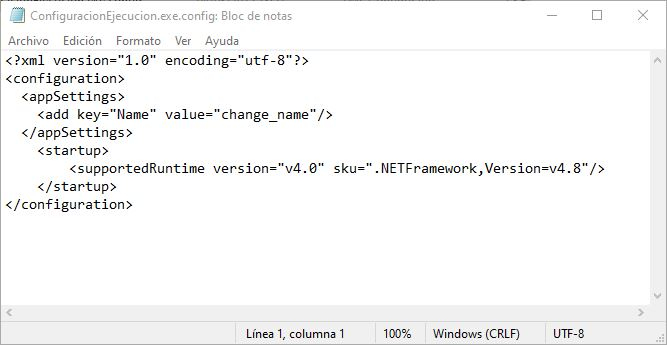
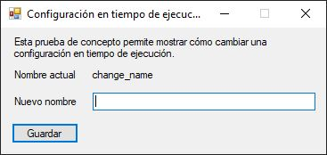
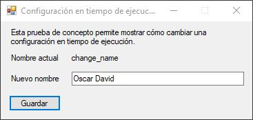
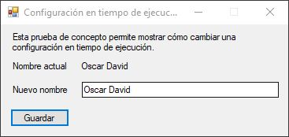
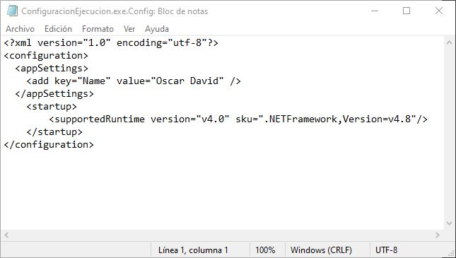

# Introducción

En este repostiorio se encuentra una prueba de concepto para mostrar la forma de cambiar la configuración de una aplicación en tiempo de ejecución.

El proyecto consiste en una aplicación de Windows Forms construido con .NET Framework 4.8 usando el lenguaje de Visual Basic.

# Ejecución

Abrir con Visual Studio la solución [ConfigureExecution.sln](src/ConfigureExecution.sln) ubicada en la carpeta *src*.

Ejecutar presionando F5, por defecto tomará la condifuración de *Debug*.

1. La configuración actual de la aplicación se encuentra en [src/bin/Debug/ConfiguracionEjecucion.exe.Config](src/bin/Debug/ConfiguracionEjecucion.exe.Config) y debería verse así:

   
2. En el formulario se muestra el valor actual del parámetro *"Name"*.

   
3. Modifique el nombre por el valor deseado.

   
4. Presione el botón de *"Guardar"*.

   
5. Si revisa de nuevo la configuración en [src/bin/Debug/ConfiguracionEjecucion.exe.Config](src/bin/Debug/ConfiguracionEjecucion.exe.Config) podrá ver que el valor del parámetro *"Name"* cambió.

   
